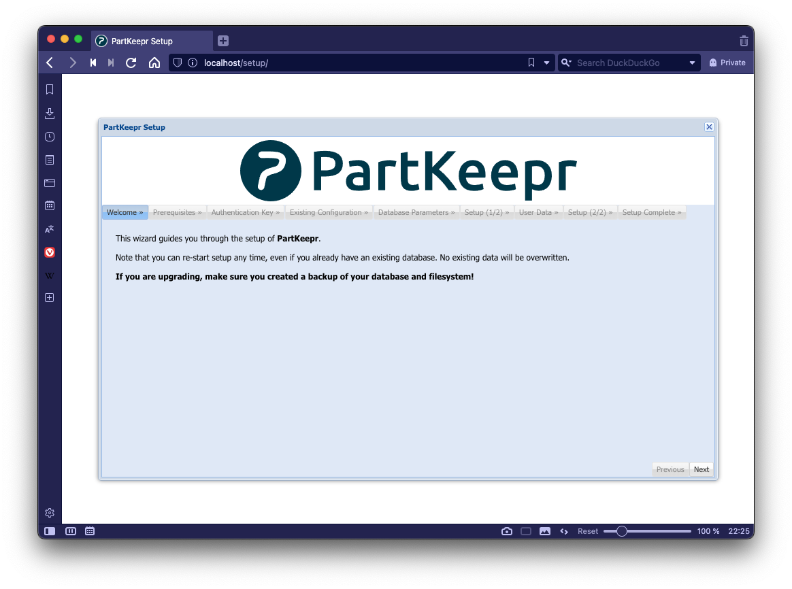
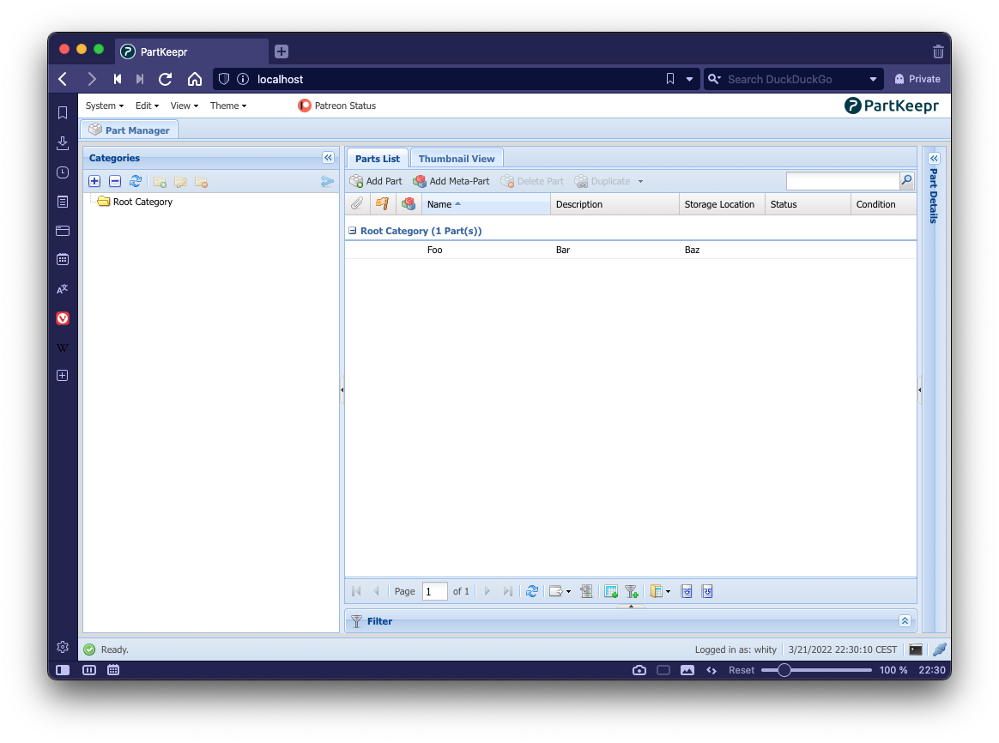
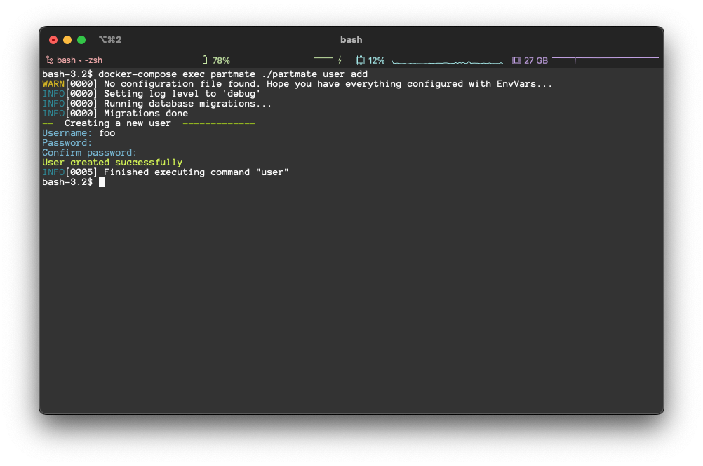
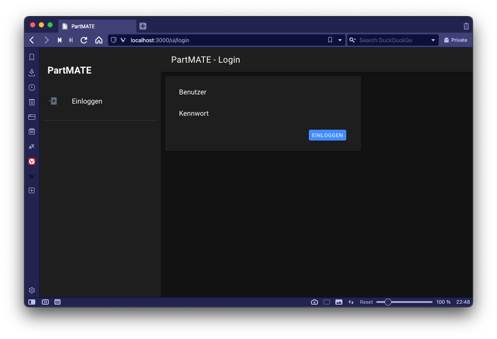

# PartMATE

[](https://github.com/chaos-hip/partmate/actions/workflows/build.yaml)

A Companion App for [PartKeepr](https://partkeepr.org) that provides quick access to the most essential functions via mobile-friendly web interface.

The [RepairCafé Hilpoltstein](https://www.repaircafe-hilpoltstein.de) uses ParKeepr for inventory management and developed PartMATE as trustworthy companion in the daily repair business.

## Quick start

Follow the steps below to get a development stack running on your local machine. This will launch a fresh PartMATE instance as well as PartKeepr, MariaDB and Adminer.

## Preparation

In order to set-up the basic settings needed for the development stack, you have to set the required environment variables to use when launching the stack using `docker-compose`. These variables are defined in a file named `.env` that needs to sit right beside the `docker-compose.yml`. To set it up,

- Copy the file `env.example` to `.env`
  ```
  cp env.example .env
  ```
- Open the `.env` file with your editor of choice - for example:

  ```
  vi .env
  ```

  or

  ```
  nano .env
  ```

  It is recommended to at least change the values for `MARIA_ROOT_PASSWORD` and `PARTKEEPR_SECRET`.

## First launch

When starting the stack for the first time, you need to set-up PartKeepr first before launching PartMATE - else the database setup will fail.

### Setting up PartKeepr

Start up MariaDB and PartKeepr only by entering

```
docker-compose up -d mariadb partkeepr
```

This will create a new, empty database and launch the PartKeepr container.

Now, run the PartKeepr setup wizard by pointing your browser to http://localhost:8080/setup.



When being asked for the `Authentication Key`, run

```
docker-compose exec partkeepr cat app/authkey.php
```

in your terminal to get the required key.

After finishing the wizard, you can log-in into PartKeepr with the user you created during the setup.



### Setting up PartMATE

After setting up PartKeepr, you can start up the rest of the services by executing

```
docker-compose up -d
```

This will launch an [Adminer](https://www.adminer.org) for easy database management as well as PartMATE.

On its first launch, PartMATE will create its own database tables inside the PartKeepr database. After this step, the only thing left is to create a user that is allowed to connect to PartMATE.

Creating a new user can be done using the command line. Execute

```
docker-compose exec partmate ./partmate user add
```

and follow the instructions to create a new user for you to use.



Once the user has been created, you can connect to PartMATE by browsing to http://localhost:3000



## Connecting to the running services

Using `docker-compose`, the following services will be launched on your machine:

| Service   | Port | URL                   | Description                                            |
| --------- | ---- | --------------------- | ------------------------------------------------------ |
| PartMATE  | 3000 | http://localhost:3000 | This project                                           |
| PartKeepr | 8080 | http://localhost      | Inventory management system                            |
| MariaDB   | 3306 | -                     | Database instance used by both, PartKeepr and PartMATE |
| Adminer   | 8081 | http://localhost:8080 | Database management tool                               |
